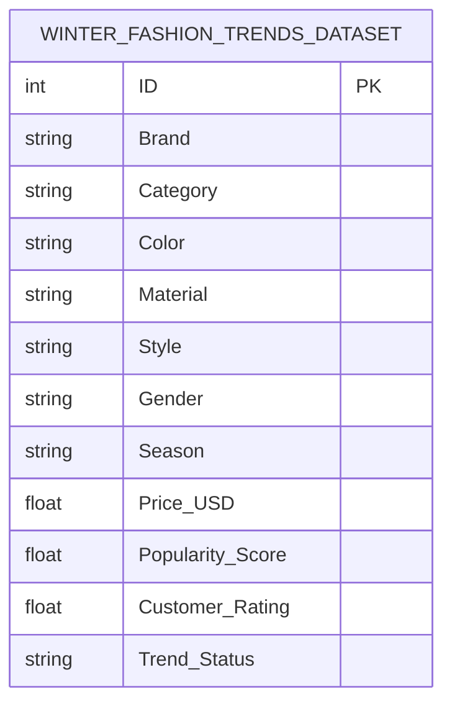
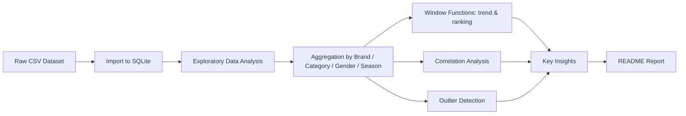

# ❄️ Winter Fashion SQL Analysis

SQL-based market analysis project exploring consumer trends, brand popularity, and pricing patterns in Indonesia's fashion retail industry.

This project explores key insights from a **Winter Fashion Trends Dataset** using **SQL**. The analysis focuses on product pricing, brand popularity, and customer preferences across different segments in the fashion retail industry — 150 products across 10 brands and 10 categories.

---

## 📊 Objectives

- Understand the **average price** and **customer rating** across product categories.
- Identify the **most popular brands** for each gender segment.
- Examine **trends over time** (brand popularity by season).
- Evaluate the **correlation** between price, rating, and popularity.

---

## 🧰 Tools Used

- **SQL** (SQLite) for data analysis
- **[SQLite Online](https://sqliteonline.com/)** — run queries directly in the browser, no local install needed
- **GitHub** for version control and portfolio documentation

---

## 📁 Dataset

- Source: *Winter Fashion Trends Dataset* (public dataset for learning purposes)
- 150 records, 12 columns: `ID`, `Brand`, `Category`, `Color`, `Material`, `Style`, `Gender`, `Season`, `Price(USD)`, `Popularity_Score`, `Customer_Rating`, `Trend_Status`
- 10 unique brands, 10 unique categories

---

## 🗂️ Data Schema

## 🔄 Analysis Flow

## 🔍 Dataset Overview

**Total records: 150** | **Unique brands: 10** | **Unique categories: 10**

**Average price: $443.11** | **Average customer rating: 3.8 / 5**

Preview (first 5 rows):

| ID | Brand | Category | Color | Material | Style | Gender | Season | Price(USD) | Popularity_Score | Customer_Rating | Trend_Status |
|---|---|---|---|---|---|---|---|---|---|---|---|
| 1 | Adidas | Gloves | Brown | Polyester | Streetwear | Women | Winter 2025 | 244.06 | 6 | 4.9 | Trending |
| 2 | Gucci | Gloves | Red | Leather | Sporty | Men | Winter 2023 | 366.73 | 8.8 | 3.3 | Trending |
| 3 | H&M | Coat | Brown | Fleece | Streetwear | Unisex | Winter 2025 | 741.55 | 4.8 | 3.5 | Trending |
| 4 | North Face | Coat | Blue | Cashmere | Formal | Men | Winter 2024 | 116.09 | 7.5 | 3.1 | Outdated |
| 5 | Mango | Thermal | Blue | Cashmere | Formal | Unisex | Winter 2025 | 193.16 | 7.8 | 4.3 | Outdated |

---

## 🧮 Key Insights

### 1. Popularity by category

Boots and sweaters are the standout performers — despite scarves having the most listings, they rank near the bottom for popularity.

| Category | Items | Avg. Popularity |
|---|---|---|
| Boots | 11 | 7.06 |
| Sweater | 17 | 6.58 |
| Coat | 14 | 6.2 |
| Gloves | 18 | 6.02 |
| Beanie | 12 | 5.97 |
| Scarf | 23 | 5.48 |
| Jacket | 14 | 5.34 |
| Thermal | 19 | 5.16 |
| Hoodie | 11 | 4.99 |
| Cardigan | 11 | 4.95 |

### 2. Brand performance

**Mango**, **Zara**, and **Nike** lead in average popularity, while **Uniqlo** and **Prada** score highest on customer rating despite lower popularity.

| Brand | Avg. Popularity | Avg. Rating |
|---|---|---|
| Mango | 6.53 | 3.74 |
| Zara | 6.48 | 3.72 |
| Nike | 6.46 | 3.54 |
| Adidas | 6.27 | 3.96 |
| North Face | 5.85 | 3.73 |
| Levi's | 5.83 | 3.45 |
| Gucci | 5.64 | 3.66 |
| H&M | 5.25 | 4.07 |
| Prada | 4.69 | 3.96 |
| Uniqlo | 4.61 | 4.07 |

### 3. Gender segment comparison

Unisex products lead in popularity despite Women's items commanding the highest average price.

| Gender | Avg. Price | Avg. Popularity | Avg. Rating |
|---|---|---|---|
| Unisex | $434.59 | 6.4 | 3.81 |
| Men | $436.21 | 5.85 | 3.58 |
| Women | $458.68 | 4.99 | 3.99 |

### 4. Price segment vs. popularity

Cheaper products (**Low Range**) actually outperform expensive ones (**High Range**) in both popularity and rating — reinforcing the weak/negative price–popularity correlation below.

| Price Segment | Items | Avg. Rating | Avg. Popularity |
|---|---|---|---|
| Low Range (<$50) | 76 | 3.72 | 6.03 |
| High Range (>$150) | 74 | 3.89 | 5.49 |

### 5. Trend by season

Popularity has been trending slightly downward across the three most recent winters, even as average price rose in Winter 2025.

| Season | Items | Avg. Price | Avg. Popularity |
|---|---|---|---|
| Winter 2023 | 42 | $428.96 | 5.84 |
| Winter 2024 | 52 | $418.97 | 5.79 |
| Winter 2025 | 56 | $476.13 | 5.68 |

### 6. Correlation analysis

| Correlation Pair | Value | Interpretation |
|---|---|---|
| Price ↔ Popularity | **-0.04** | essentially no relationship |
| Rating ↔ Popularity | **-0.08** | essentially no relationship |

Popularity does not appear to be driven by price or customer rating alone — other factors (marketing, seasonality, trend cycles) likely play a bigger role.

### 7. Best brand per category (top pick)

| Category | Top Brand | Avg. Popularity |
|---|---|---|
| Beanie | Zara | 8.43 |
| Boots | Levi's | 9.5 |
| Cardigan | Levi's | 9.6 |
| Coat | North Face | 7.88 |
| Gloves | Adidas | 7.7 |
| Hoodie | Uniqlo | 8.3 |
| Jacket | Adidas | 9.2 |
| Scarf | Zara | 10.0 |
| Sweater | Mango | 8.32 |
| Thermal | Zara | 7.7 |

---

## 🧑‍🔬 Methodology

1. Cleaned and imported the dataset (`Winter_Fashion_Trends_Dataset.csv`) into a SQLite database.
2. Ran exploratory queries (`PRAGMA table_info`, row counts, unique value counts).
3. Aggregated popularity, price, and rating across brand, category, gender, color, style, and season.
4. Used window functions (`LAG`, `RANK`) to track brand popularity trends across seasons and rank top brands per category.
5. Computed Pearson correlation coefficients manually (price–popularity, rating–popularity) since SQLite has no built-in `CORR()`.
6. Flagged statistical outliers (products with popularity beyond 2 standard deviations from the mean).

All 23 queries are available in [`winter_fashion_trend_analysis_sqlite.sql`](./winter_fashion_trend_analysis_sqlite.sql), written for SQLite and runnable directly in [SQLite Online](https://sqliteonline.com/) — no local database install required. Full query-by-query output is in [`query_results.md`](./query_results.md).

---

## 🚀 About the Project

This project demonstrates practical SQL querying for data exploration and correlation analysis, including CTEs, window functions, and manual statistical calculations. It is designed as a portfolio piece to showcase **data analysis**, **pattern recognition**, and **business insight generation** skills.

---

## 🧑‍💻 Author

**Pudi Anang Winarkoro**
📍 Yogyakarta, Indonesia
📧 pudi.winarkoro@gmail.com
🔗 [LinkedIn](https://linkedin.com/in/pudi-anang-63703a1b9)
